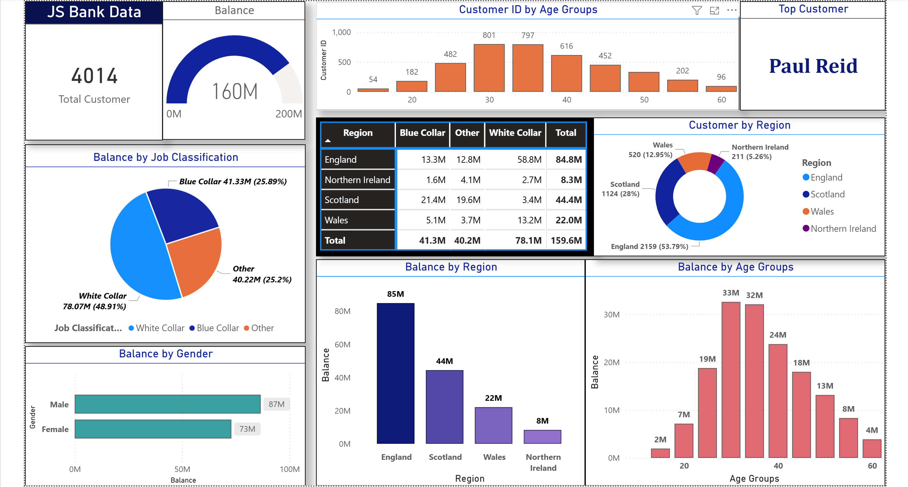
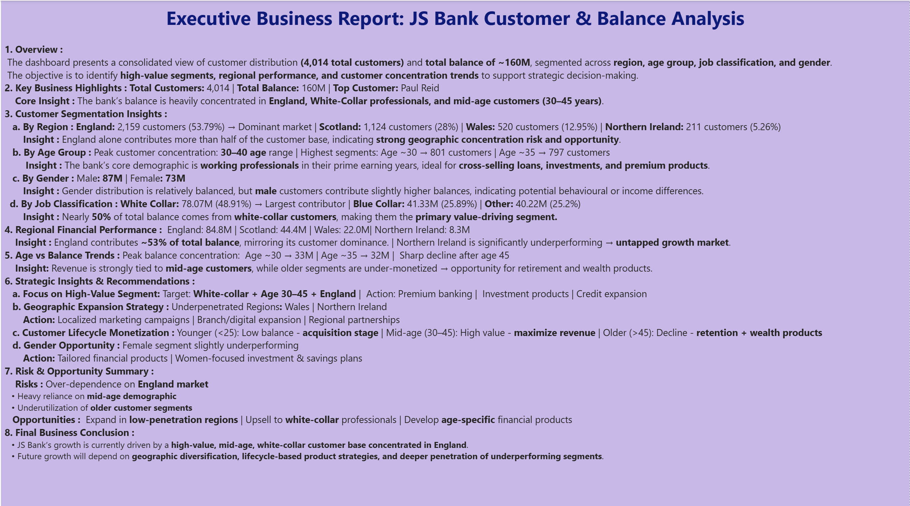

# 📊 JS Bank Customer & Balance Analysis Dashboard

## 🚀 Project Overview
This project presents an interactive **Power BI dashboard** analyzing customer distribution and financial balance across multiple dimensions including **region, age group, job classification, and gender**.

The objective is to uncover **high-value customer segments**, identify **regional performance trends**, and provide **data-driven business insights**.

---

## 🎯 Business Problem
Banks need to understand:
- Which customer segments generate the most revenue
- How customer distribution varies across regions
- Where growth opportunities exist

This dashboard helps answer these questions through **visual analytics and segmentation**.

---

## 📌 Key Metrics
- 👥 Total Customers: **4,014**
- 💰 Total Balance: **160M**
- 🏆 Top Customer: **Paul Reid**

---

## 📊 Dashboard Features

### 1. Customer Segmentation
- Age group distribution
- Gender-based analysis
- Job classification breakdown

### 2. Financial Analysis
- Balance by region
- Balance by age group
- Balance by job type

### 3. Regional Insights
- Customer distribution by region
- Comparative performance across regions

---

## 🔍 Key Insights

- 📍 **England contributes ~54% of customers and ~53% of total balance**, making it the primary market
- 💼 **White-collar customers contribute ~49% of total balance**, the highest among all segments
- 👨‍💼 **Customers aged 30–40 are the most valuable segment**, contributing the highest balance
- ⚖️ Gender distribution is balanced, but **male customers contribute slightly higher balances**
- 📉 **Northern Ireland and Wales are underperforming regions**, indicating growth opportunities

---

## 💡 Business Recommendations

- 🎯 Focus on **high-value segments (White-collar, Age 30–45)**
- 🌍 Expand operations in **underperforming regions**
- 🔄 Implement **customer lifecycle strategies** for better retention
- 👩 Increase engagement in the **female customer segment**
- 💳 Introduce **premium and investment products** for mid-age professionals

---

## 🛠️ Tools & Technologies

- **Power BI** – Data visualization & dashboarding  
- **Excel / CSV** – Data source  
- **DAX** – Measures & calculations  
- **Data Modeling** – Relationships & transformations  

---

## 📷 Dashboard Preview

---

## 📈 Skills Demonstrated

- Data Cleaning & Transformation  
- Exploratory Data Analysis (EDA)  
- Data Visualization & Storytelling  
- Business Insight Generation  
- Dashboard Design (UX + Layout Thinking)  

---

## 🧠 Business Impact

This project demonstrates the ability to:
- Translate raw data into **actionable insights**
- Identify **revenue-driving customer segments**
- Support **strategic decision-making with data**

---

⭐ If you found this project useful, consider giving it a star!

